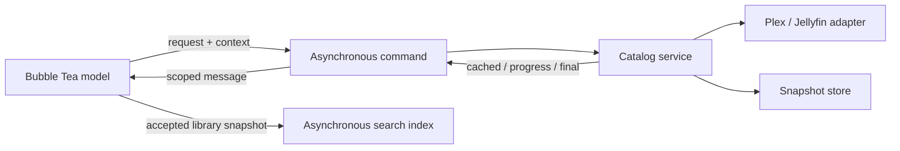

# Application architecture

Kino uses one path for collection data: TUI command → catalog → backend and
snapshot store → scoped TUI result. Libraries, movies, shows, mixed collections,
seasons, episodes, playlists, and playlist items follow this path.

## Responsibilities

- **TUI:** navigation, selection, filtering, sorting, modal state, and presentation.
  Its consumer interfaces expose application operations. Update does not decode
  the cache, persist changes, search the index, or perform network I/O. View renders
  state; layout belongs to Update. Inspector selection is reconciled after every
  model update, including filtering that changes the item without moving its index.
- **Domain:** entity identity, metadata, and watch-state semantics. Collection
  consumers require only identity and title. TUI presenters supply formatting,
  navigation affordances, and sort metadata.
- **Catalog:** resource identity, cache freshness, shared fetches, pagination,
  deadlines, remote mutations, and cache reconciliation. A resource identifies a
  collection and its ancestry; the optional server version is separate from identity.
- **Backend adapters:** protocol details, DTO conversion, headers, retries, and
  error classification. Mutations are not automatically retried. Plex identity
  discovery happens lazily within the playlist write that needs it.
- **Store:** detached snapshots and atomic persistence. BoltDB is authoritative
  when available; memory-only mode is the fallback. There is no disk-to-memory
  read promotion. Payload, fetch time, and server version are written together.
- **Search index:** detached library snapshots ordered by revision. Index updates
  and queries run in commands; search uses the currently available library list.
- **Playback service:** URL resolution, a 15-second operation deadline, cancellable
  player discovery, and process launch. Launched players have independent lifetimes;
  child processes are reaped asynchronously.

## Requests and ownership

Every UI operation has an owner and a monotonically increasing request ID.
Foreground views and background synchronization have separate owners, allowing
both to subscribe to the same catalog fetch. Modal dismissal, navigation, and
request replacement cancel the appropriate subscription. Successes, errors, and
progress all require ownership before affecting the model.

Catalog fetches are shared per resource. A refresh or mutation supersedes older
work; the ownership check and cache commit happen under the same service lock.
An obsolete fetch cannot persist after its replacement. Still-interested subscribers
join replacement work, while removing the last subscriber cancels the fetch.

Cache reads and decoding run outside the catalog mutex. The catalog registers a
resource before reading and checks its revision after decoding; an intervening
commit discards that observation and repeats the read. A fetch uses this same
observation for count validation. Cache writes and mutation reconciliation remain
inside the commit fence, so refresh and mutation ordering also governs persistence.

Snapshots and mutations also carry resource revisions. These fence responses that
were already queued when a newer result or mutation reached the UI. Library counts
and status obey the same rule as column contents. Cached payload revisions remain
separate from committed result revisions if persistence fails.

The TUI stores one record per collection: resource identity, accepted snapshot,
minimum acceptable revision, last error, and background subscription identity.
The minimum acceptable revision is independent of the displayed snapshot revision.
Rejecting an obsolete terminal response without a usable replacement schedules a
read at the required revision. A failure from that recovery attempt stops with a
retry hint. Error ordering follows the attempt, independently of the revision of
any cached fallback payload.

Load results and mutation snapshots use the same acceptance and projection path.
An equal revision updates feedback without rebuilding column content or the search
index. Opening a column projects the retained snapshot immediately, then starts a
catalog request to check freshness. Columns retain their own cursor, sort, filter,
and scroll state while navigation changes the focused column.

The catalog explicitly reports when a subscriber is waiting on network work.
A result separately records whether it was validated against the server: count
validation can reuse a cached payload, while a pure cache hit cannot clear a
previous network error.

Cached observations and progress may coalesce. A final result has its own buffered
channel and cannot be dropped behind progress or strand a producer after cancellation.

## Freshness and offline behavior

| Policy | Behavior |
| --- | --- |
| Browse | Return a fresh snapshot, or show retained data while fetching; join existing work. |
| Revalidate | Check the server even with fresh data. Young library snapshots may use a count check. |
| Refresh | Supersede active work and fetch a complete replacement. Retain the old snapshot until success. |

Every collection has a five-minute maximum cache age, checked on access.
A count check, local watch patch, or cache read never renews the fetch timestamp.
Expired snapshots require a full fetch even if counts and server versions match.
There is no periodic polling while a view sits idle; explicit refresh is available.

A failed refresh preserves usable cached data and returns the error with it.
Authentication failures retain their classification and produce a persistent
sign-in alert. Cancellation is silent; deadlines and other failures are visible.
A missing resource is not returned as a successful cached result. A successful
fetch whose cache write fails remains usable and carries a persistence warning.

Library-content fetches have a ten-minute deadline to accommodate pagination;
other collection requests and catalog mutations have thirty seconds. Caller
cancellation and the service lifetime also bound all operations.

## UI feedback

| Situation | Presentation |
| --- | --- |
| Initial load without a snapshot | Column opens immediately; network spinner appears after 200 ms |
| Refresh with a snapshot, including an empty one | Items remain usable; network spinner appears after 200 ms |
| Failed initial load | Failure message and retry hint |
| Failed refresh | Retained items and persistent column retry hint |
| Background library or playlist load | Delayed row spinner and aggregate footer activity; progress in inspector |
| Playback or mutation pending | Footer pending indicator until completion |
| Playlist membership loading | Immediate loading modal; Escape cancels it |
| Search query pending | Fixed viewport retains results; activity appears after 200 ms; pending results cannot be activated |

Counts describe the last complete snapshot and never double as download progress.
With `ui.show_library_counts` enabled, known counts (including zero) remain visible
in library rows. With it disabled, counts never flash during or after a load.
The inspector uses the same summary and labels progress separately. Failed refreshes
retain the summary and a retry hint; a cache hit alone cannot clear the error.

Collection feedback combines the accepted snapshot with all active subscribers.
Columns, library rows, and inspector summaries receive the same feedback value.
Initial loading, refreshing, and failure presentation are derived from pending
requests, content availability, and errors; content replacement does not complete
a request. Inspector scrolling resets only when the selected identity changes.

Routine reads and background completion are silent: there is no temporary library
success checkmark or count-expiry timer. Indicator space is reserved to keep titles
stationary. Delayed indicator messages require current request ownership, so quick
loads and canceled requests cannot flash a spinner afterward.

One subscriber finishing cannot clear another subscriber's loading indication.
Authoritative parent changes preserve selection by identity where possible and
close orphaned navigation branches. Removed libraries lose their subscriptions
and sync status, so late responses cannot recreate them.

## Mutations and shutdown

Catalog serializes remote writes and reconciles before returning their result.
Watch updates patch all cached projections in one transaction and adjust parent
counters once. Successful reconciliation returns detached snapshots for affected
known collections, including show and season parents. The TUI applies these
snapshots without inferring watch changes from open columns. Missing or invalid
cached projections require server revalidation. Playlist changes expire affected snapshots while retaining offline
fallbacks. Uncertain or partial remote writes return errors and affected resources
for revalidation. Persistence failures remain explicit.

Playlist membership uses up to four workers and verifies every displayed checkbox.
If any membership is unknown, the modal receives an error instead of an editable
map that would mistake unknown for absent.

On shutdown, contexts are canceled and catalog operations are drained before the
database closes, including reconciliation after canceled writes. Logout clears
the cache only after that drain and database close.

## Storage and backend constraints

The `snapshots` bucket stores collection payloads. Opening the cache removes
incompatible collection buckets and unused JSON cache files. Offline browsing
requires persisted snapshots for the selected server and user.

Backend capability differences, including Plex's inability to create empty
playlists, are reported by the adapters. The application does not negotiate
backend capabilities.

## Verification

Regression tests cover fetch supersession, commit fencing, subscriber cancellation,
shutdown draining, cache-write failure, freshness, uncertain mutations, membership
errors, typed columns, scoped UI responses, modal cancellation, loading states, and
search revisions. Backend tests exercise the same error contract through local
HTTP servers. A TUI integration test uses the real catalog and disk store through
cached loading, shared refresh, mutation, offline fallback, and database reopening.
Reconciliation tests cover mutations before queued load results, navigation during
watch updates, inspector selection, duplicate revisions, and recovery failures.
Concurrency tests cover independent cache reads and mutation fencing during decoding.

Run `go test -race ./...`, `go vet ./...`, and `go build ./cmd/kino`.
Use `go test ./internal/catalog -run '^$' -bench BenchmarkCachedLibraries -benchmem`
to measure parallel cached-load throughput for small and large disk snapshots.
