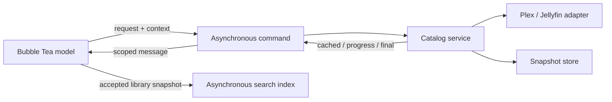

# Application architecture

Kino uses one path for collection data: TUI command → catalog → backend and
snapshot store → scoped TUI result. Libraries, movies, shows, mixed collections,
seasons, episodes, playlists, and playlist items follow this path.

## Responsibilities

- **TUI:** navigation, selection, filtering, sorting, modal state, and presentation.
  Its consumer interfaces expose application operations. Update does not decode
  the cache, persist changes, search the index, or perform network I/O. View renders
  state; layout and inspector updates belong to Update.
- **Catalog:** resource identity, cache freshness, shared fetches, pagination,
  deadlines, remote mutations, and cache reconciliation. A resource identifies a
  collection and its ancestry; the optional server version is separate from identity.
- **Backend adapters:** protocol details, DTO conversion, headers, retries, and
  error classification. Mutations are not automatically retried. Plex identity
  discovery happens lazily within the playlist write that needs it.
- **Store:** detached snapshots and atomic persistence. BoltDB is authoritative
  when available; memory-only mode is the fallback. There is no disk-to-memory
  read promotion. Payload, fetch time, and server version are written together.
- **Search index:** detached library snapshots ordered by revision. Index updates
  and queries run in commands; search uses the currently available library list.
- **Playback service:** URL resolution, a 15-second operation deadline, cancellable
  player discovery, and process launch. Launched players have independent lifetimes;
  child processes are reaped asynchronously.

## Requests and ownership

Every UI operation has an owner and a monotonically increasing request ID.
Foreground views and background synchronization have separate owners, allowing
both to subscribe to the same catalog fetch. Modal dismissal, navigation, and
request replacement cancel the appropriate subscription. Successes, errors, and
progress all require ownership before affecting the model.

Catalog fetches are shared per resource. A refresh or mutation supersedes older
work; the ownership check and cache commit happen under the same service lock.
An obsolete fetch cannot persist after its replacement. Still-interested subscribers
join replacement work, while removing the last subscriber cancels the fetch.

Snapshots and mutations also carry resource revisions. These fence responses that
were already queued when a newer result or mutation reached the UI. Library counts
and status obey the same rule as column contents. Cached payload revisions remain
separate from committed result revisions if persistence fails.

Cached observations and progress may coalesce. A final result has its own buffered
channel and cannot be dropped behind progress or strand a producer after cancellation.

## Freshness and offline behavior

| Policy | Behavior |
| --- | --- |
| Browse | Return a fresh snapshot, or show retained data while fetching; join existing work. |
| Revalidate | Check the server even with fresh data. Young library snapshots may use a count check. |
| Refresh | Supersede active work and fetch a complete replacement. Retain the old snapshot until success. |

Every collection has a five-minute maximum cache age, checked on access.
A count check, local watch patch, or cache read never renews the fetch timestamp.
Expired snapshots require a full fetch even if counts and server versions match.
There is no periodic polling while a view sits idle; explicit refresh is available.

A failed refresh preserves usable cached data and returns the error with it.
Authentication failures retain their classification and produce a persistent
sign-in alert. Cancellation is silent; deadlines and other failures are visible.
A missing resource is not returned as a successful cached result. A successful
fetch whose cache write fails remains usable and carries a persistence warning.

Library-content fetches have a ten-minute deadline to accommodate pagination;
other collection requests and catalog mutations have thirty seconds. Caller
cancellation and the service lifetime also bound all operations.

## UI feedback

| Situation | Presentation |
| --- | --- |
| Initial load without a snapshot | Column loading indicator |
| Refresh with a snapshot, including an empty one | Items remain usable; title spinner |
| Failed initial load | Failure message and retry hint |
| Failed refresh | Retained items and persistent column retry hint |
| Background library or playlist load | Row progress and aggregate footer activity |
| Playback or mutation pending | Footer pending indicator until completion |
| Playlist membership loading | Immediate loading modal; Escape cancels it |
| Search query pending | Loading state; older query results cannot replace it |

One subscriber finishing cannot clear another subscriber's loading indication.
Authoritative parent changes preserve selection by identity where possible and
close orphaned navigation branches. Removed libraries lose their subscriptions
and sync status, so late responses cannot recreate them.

## Mutations and shutdown

Catalog serializes remote writes and reconciles before returning their result.
Watch updates patch all cached projections in one transaction and adjust parent
counters once. Playlist changes expire affected snapshots while retaining offline
fallbacks. Uncertain or partial remote writes return errors and affected resources
for revalidation. Persistence failures remain explicit.

Playlist membership uses up to four workers and verifies every displayed checkbox.
If any membership is unknown, the modal receives an error instead of an editable
map that would mistake unknown for absent.

On shutdown, contexts are canceled and catalog operations are drained before the
database closes, including reconciliation after canceled writes. Logout clears
the cache only after that drain and database close.

## Storage transition and deferred work

The snapshot schema replaces the old per-content cache buckets. Those disposable
buckets are removed on opening the cache and rebuilt through subsequent online
loads. Existing credentials and configuration are unaffected. Offline browsing
requires snapshots populated in the new format.

Backend capability differences, including Plex's inability to create empty
playlists, are deliberately deferred. This architecture does not add capability
negotiation or change those backend behaviors.

## Verification

Regression tests cover fetch supersession, commit fencing, subscriber cancellation,
shutdown draining, cache-write failure, freshness, uncertain mutations, membership
errors, typed columns, scoped UI responses, modal cancellation, loading states, and
search revisions. Backend tests exercise the same error contract through local
HTTP servers. A TUI integration test uses the real catalog and disk store through
cached loading, shared refresh, mutation, offline fallback, and database reopening.

Run `go test -race ./...`, `go vet ./...`, and `go build ./cmd/kino`.
